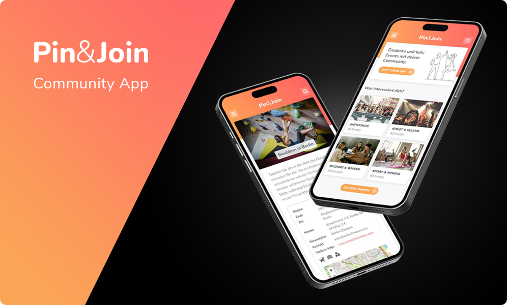

# Welcome to Pin&Join

Pin&Join is a dynamic platform designed to foster local engagement through social interaction. Our intuitive web interface connects community members, allowing them to participate in and create local events. Access the app [here on Vercel](https://community-app-topaz.vercel.app).

> **Digitales Gesellenstück**: This project is the capstone for the neuefische web development bootcamp, crafted with dedication by [Annette](), [Bruno](), [Lea](), and [Mareike]().

## Description

Pin&Join is an event management application that enables users to actively engage with their local communities by finding and creating events. It emphasizes accessibility, allowing for quick user onboarding with GitHub account integration.

## Key Features

- **Event Management**: Users can create and manage local events to boost community participation.
- **Search and Filter**: Users can find events that cater to their interests with robust search and filtering tools.
- **Accessibility Features**: The app provides visual cues about event accessibility, enhancing usability for all users.
- **Interactive Event Map**: Users can locate and navigate to events with an integrated, interactive map.
- **Real-Time Updates**: The app features daily updates with real events from Cologne, ensuring the content is current and relevant.
- **User Feedback**: There is a system in place for users to provide feedback on events, promoting a community-driven approach to improvement.
- **Secure Authentication**: Ensures safe user registration and login.

## Technology Stack

- React / Next.js for robust front-end development
- React Hooks for state and lifecycle management
- React Router for effective page routing
- Styled Components for component-specific styling
- [NextAuth for secure authentication](https://next-auth.js.org/)
- [Cloudinary for image hosting](https://cloudinary.com/)
- [MongoDB for backend data storage](https://www.mongodb.com/)
- Mongoose for data modeling
- [City of Cologne Event API for real-time event data](https://offenedaten-koeln.de/dataset/veranstaltungen-der-stadt-k%C3%Bln/resource/94d5e889-ed56-403d-9cd6-4e98d3d5c8bd)
- [Leaflet for interactive maps](https://leafletjs.com/)

## Contact Us

## Getting Started

To set up Pin&Join on your local machine, follow these steps:

1. Clone the repository to your local machine.
2. Run `npm install` to install all required dependencies.
3. Start the application in development mode by executing `npm run dev`, then visit [http://localhost:3000](http://localhost:3000) in your browser to see it in action.

### Local Development

For developers:

1. After cloning the repository, install dependencies with `npm install`.
2. Launch the development server using `npm run dev`.
3. Access the app via the local server URL provided in your terminal.

This streamlined setup guide will help you get up and running with the application quickly for development and testing purposes.
